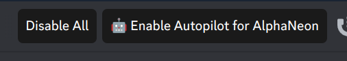
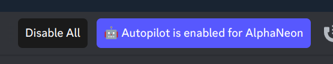
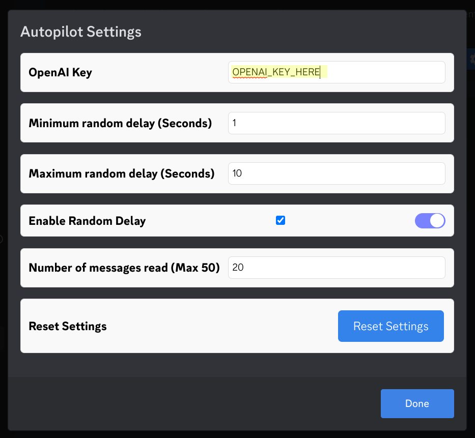

# AutoPilot - Your AI AutoPilot for Discord

A BetterDiscord plugin that enhances your Discord experience by integrating the ChatGPT / GPT3.5 model. It allows you to generate and send AI-powered replies to Discord DMs automatically.

## Features

- When enabled, autopilot will automatically reply to enabled channels with GPT responses based on your conversation

## Requirements

- BetterDiscord: To use this plugin, you need to have BetterDiscord installed. If you don't have it, you can install it from the official [BetterDiscord website](https://betterdiscord.app/).
- OpenAPI Key
- ZeresPluginLibrary - You can get the library plugin from [Here](https://betterdiscord.app/plugin/ZeresPluginLibrary)

## Installation

1. First, make sure you have BetterDiscord installed.
2. Download the `.plugin.js` file from the repository
4. Move the downloaded `.plugin.js` file to the BetterDiscord plugins folder. The location of the folder depends on your operating system:
   - Windows: `%appdata%\betterdiscord\plugins`
   - macOS: `~/Library/Preferences/BetterDiscord/plugins`
   - Linux: `~/.config/BetterDiscord/plugins`
5. Restart Discord.
6. Open Discord settings, navigate to the Plugins section, and enable the "AutoPilot" plugin from the list.

## Usage

1. Once the plugin is enabled, you will see a few new buttons in your DMs. Enable any channels you want to have AutoPilot reply to.

   
   

2. In order to use it, you must provide your OpenAI API key in the plugin settings. You can get your key [Here](https://platform.openai.com/account/api-keys)

   

   - __Note: your OpenAI key isn't uploaded anywhere, and is kept on your local machine. Please be sure not to share this anywhere__
4. Once you input your key, you can now toggle on or off AutoPilot next to the gift icon.
5. Please note it is best to mess with settings to determine how accurate the AI will be replying for you.

## Known Issues

- This plugin is new, and has lots of undiscovered issues. Report any in the issues tab please.

## Contributing

Contributions are welcome! If you find any bugs or want to suggest improvements, please or submit a pull request.
